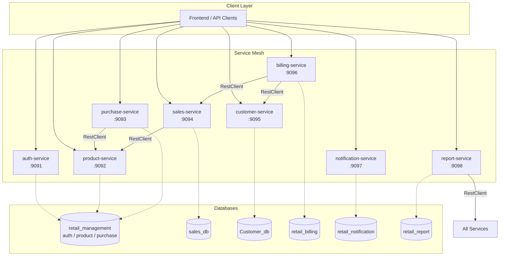
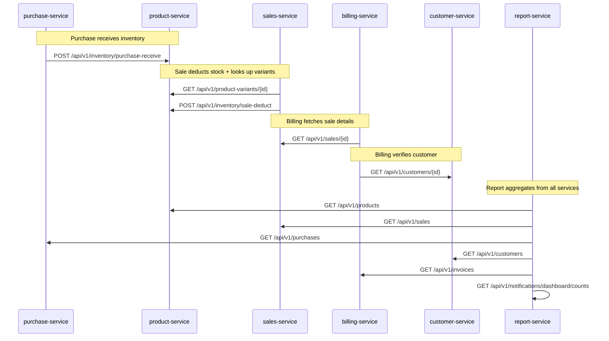

# Retail Management System

A production-grade microservices backend for retail operations, built with Spring Boot 3.5 and Java 21. Handles authentication, product catalog, inventory, purchasing, sales, customer management, billing, notifications, and reporting.

## Architecture



### Inter-Service Communication

Services communicate synchronously via Spring RestClient (HTTP).



## Tech Stack

| Layer | Technology |
|---|---|
| Language | Java 21 |
| Framework | Spring Boot 3.5.16 |
| Security | Spring Security + JWT (JJWT 0.13) |
| ORM | Spring Data JPA / Hibernate |
| Database | PostgreSQL |
| Migrations | Flyway (billing, notification, report) |
| Validation | Jakarta Bean Validation |
| HTTP Client | Spring RestClient (JDK 21 HttpClient) |
| Code Generation | Lombok |
| Testing | JUnit 5 + H2 in-memory |
| Monitoring | Spring Boot Actuator |

## Microservices

| Service | Port | Database | Purpose |
|---|---|---|---|
| **auth-service** | 9091 | retail_management | JWT authentication, user/role management, account security |
| **product-service** | 9092 | retail_management | Products, variants, brands, categories, attributes, inventory, stock movements |
| **purchase-service** | 9093 | retail_management | Supplier management, purchase orders, inventory receiving |
| **sales-service** | 9094 | sales_db | Sales transactions, payments, inventory deduction |
| **customer-service** | 9095 | Customer_db | Customer profiles, addresses, search |
| **billing-service** | 9096 | retail_billing | Invoice generation, payment tracking, billing lifecycle |
| **notification-service** | 9097 | retail_notification | Notification CRUD, delivery tracking, retry logic |
| **report-service** | 9098 | retail_report | Sales reports, P&L, inventory status, executive dashboard |

## Project Structure

```
Retail-Management-System/
├── auth-service/              # Authentication & authorization
│   └── src/main/java/com/retail/auth/
│       ├── config/            # RoleSeeder, OwnerSeeder, PasswordConfig
│       ├── controller/        # AuthController, UserController
│       ├── dto/               # LoginRequest, RegisterRequest, etc.
│       ├── entity/            # User, Role
│       ├── exception/         # AccountLockedException, etc.
│       ├── repository/        # UserRepository, RoleRepository
│       ├── security/          # JwtService, SecurityConfig, JwtAuthenticationFilter
│       └── service/           # AuthService, UserService, UserSecurityService
│
├── product-service/           # Product catalog & inventory
│   └── src/main/java/com/retail/product_service/
│       ├── controller/        # ProductController, CategoryController, BrandController, ...
│       │   └── integration/   # PurchaseIntegrationController, SalesIntegrationController
│       ├── dto/               # Request/Response DTOs + integration DTOs
│       ├── entity/            # Product, ProductVariant, Category, Brand, Attribute, Inventory, ...
│       ├── exception/         # GlobalExceptionHandler, custom exceptions
│       ├── mapper/            # Entity-DTO mappers
│       ├── repository/        # Spring Data repositories
│       └── service/           # Service interfaces + impls
│
├── purchase-service/          # Procurement & suppliers
│   └── src/main/java/com/retail/purchase_service/
│       ├── client/            # InventoryClient interface
│       │   └── impl/          # RestInventoryClient (calls product-service)
│       ├── config/            # RestClientConfig
│       ├── controller/        # PurchaseController
│       ├── dto/               # Request/Response + integration DTOs
│       ├── entity/            # Purchase, PurchaseItem, Supplier
│       ├── enums/             # PurchaseStatus
│       ├── exception/         # Custom exceptions
│       ├── repository/        # Spring Data repositories
│       └── service/           # PurchaseService, SupplierService interfaces + impls
│
├── sales-service/             # Point-of-sale transactions
│   └── src/main/java/com/retail/sales_service/
│       ├── client/            # ProductClient interface
│       │   └── impl/          # RestProductClient (calls product-service)
│       ├── config/            # RestClientConfig
│       ├── controller/        # SaleController
│       ├── dto/               # Request/Response + integration DTOs
│       ├── entity/            # Sale, SaleItem, Payment
│       ├── enums/             # SaleStatus, PaymentStatus, PaymentMethod
│       ├── exception/         # GlobalExceptionHandler, custom exceptions
│       ├── mapper/            # SaleMapper
│       ├── repository/        # Spring Data repositories
│       └── service/           # SaleService interface + impl
│
├── customer-service/          # Customer relationship management
│   └── src/main/java/com/retail/customerservice/
│       ├── controller/        # CustomerController, CustomerAddressController
│       ├── dto/               # Request/Response DTOs
│       ├── entity/            # Customer, CustomerAddress
│       ├── enums/             # CustomerStatus, Gender, AddressType
│       ├── exception/         # GlobalExceptionHandler, custom exceptions
│       ├── mapper/            # CustomerMapper
│       ├── repository/        # Spring Data repositories
│       └── service/           # CustomerService interface + impl
│
├── billing-service/           # Invoicing & payment tracking
│   └── src/main/java/com/retail/billingservice/
│       ├── client/            # SalesClient, CustomerClient interfaces
│       │   └── impl/          # RestSalesClient, RestCustomerClient
│       ├── config/            # RestClientConfig
│       ├── controller/        # BillingController
│       ├── dto/               # Request/Response + sales DTOs
│       ├── entity/            # Invoice, InvoiceItem
│       ├── model/             # InvoiceStatus, PaymentMethod, PaymentStatus
│       ├── exception/         # GlobalExceptionHandler, custom exceptions
│       ├── mapper/            # BillingMapper
│       ├── repository/        # Spring Data repositories
│       └── service/           # BillingService interface + impl
│   └── src/main/resources/db/migration/  # Flyway SQL migrations
│
├── notification-service/      # Notifications & delivery tracking
│   └── src/main/java/com/retail/notificationservice/
│       ├── controller/        # NotificationController
│       ├── dto/               # Request/Response DTOs
│       ├── entity/            # Notification
│       ├── enums/             # NotificationType, NotificationStatus, ReferenceType
│       ├── exception/         # GlobalExceptionHandler, custom exceptions
│       ├── mapper/            # NotificationMapper
│       ├── repository/        # Spring Data repositories
│       └── service/           # NotificationService interface + impl
│   └── src/main/resources/db/migration/  # Flyway SQL migrations
│
├── report-service/            # Analytics & reporting
│   └── src/main/java/com/retail/reportservice/
│       ├── client/            # 6 client interfaces (Billing, Customer, Notification, Product, Purchase, Sales)
│       │   └── impl/          # RestClient implementations for each
│       ├── config/            # RestClientConfig
│       ├── controller/        # ReportController
│       ├── dto/               # Request/Response + external DTOs
│       ├── entity/            # ReportLog
│       ├── enums/             # ReportType, ReportStatus
│       ├── exception/         # GlobalExceptionHandler, custom exceptions
│       ├── mapper/            # ReportMapper
│       ├── repository/        # Spring Data repositories
│       └── service/           # ReportService interface + impl
│   └── src/main/resources/db/migration/  # Flyway SQL migrations
│
├── .env.example               # Environment variable template
├── .gitignore                 # IDE, build artifacts, secrets, logs
└── README.md
```

## Features by Service

### auth-service
- User registration with role-based access (OWNER, MANAGER, CASHIER, DEVELOPER)
- JWT authentication with configurable expiration
- Account lockout after 5 failed login attempts (15-minute cooldown)
- Password hashing with BCrypt
- Default OWNER seed on startup

### product-service
- Full product catalog: products, variants, brands, categories
- Attribute system with typed values (STRING, NUMBER, BOOLEAN, DATE)
- Inventory management with stock tracking, reorder levels, min/max thresholds
- Stock movement audit trail (PURCHASE, SALE, ADJUSTMENT, RETURN, DAMAGE)
- Product images with primary/display ordering
- Integration endpoints for purchase receiving and sale deduction

### purchase-service
- Supplier management with GST number tracking
- Purchase order lifecycle: DRAFT → PENDING → APPROVED → RECEIVED → CANCELLED
- Automatic inventory receiving via product-service integration
- Date range, status, and supplier-based filtering

### sales-service
- Sale creation with line items and multi-payment support
- Automatic product variant lookup via product-service
- Real-time inventory deduction on sale finalization
- Sale cancellation with status tracking
- Payment methods: CASH, CARD, UPI, BANK_TRANSFER, CREDIT

### customer-service
- Customer profiles with auto-generated customer codes
- Multi-address support (HOME, WORK, BILLING, SHIPPING)
- Customer search by name, email, phone, or code
- Activate/deactivate customer lifecycle

### billing-service
- Invoice generation linked to sales via RestClient
- Customer verification via customer-service
- Invoice lifecycle: DRAFT → SENT → PAID → OVERDUE → CANCELLED
- Multi-currency support with payment tracking
- Flyway-managed schema migrations

### notification-service
- Multi-type notifications: EMAIL, SMS, PUSH, IN_APP, WHATSAPP
- Delivery status tracking with retry mechanism
- Reference linking to sales, purchases, invoices, or customers
- Dashboard counts for notification analytics
- Flyway-managed schema migrations

### report-service
- Sales reports aggregated from sales-service
- Purchase reports from purchase-service
- Profit & Loss calculations
- Inventory status overview
- Executive dashboard combining all metrics
- Report logging with execution time tracking

## API Overview

### Authentication
| Method | Endpoint | Description |
|---|---|---|
| POST | `/auth/register` | Register new user (OWNER only) |
| POST | `/auth/login` | Login, returns JWT token |

### Product Service
| Method | Endpoint | Description |
|---|---|---|
| POST | `/api/v1/products` | Create product |
| GET | `/api/v1/products` | List all products |
| GET | `/api/v1/products/{id}` | Get product by ID |
| GET | `/api/v1/products/code/{code}` | Get product by code |
| POST | `/api/v1/product-variants` | Create variant |
| GET | `/api/v1/product-variants/{id}` | Get variant by ID |
| GET | `/api/v1/inventory` | List all inventory |
| GET | `/api/v1/inventory/low-stock` | Low stock alerts |
| POST | `/api/v1/inventory/purchase-receive` | Receive purchase inventory |
| POST | `/api/v1/inventory/sale-deduct` | Deduct sale inventory |

### Purchase Service
| Method | Endpoint | Description |
|---|---|---|
| POST | `/api/v1/purchases` | Create purchase order |
| GET | `/api/v1/purchases` | List all purchases |
| GET | `/api/v1/purchases/{id}` | Get purchase by ID |
| PATCH | `/api/v1/purchases/{id}/approve` | Approve purchase |
| PATCH | `/api/v1/purchases/{id}/receive` | Receive purchase |
| PATCH | `/api/v1/purchases/{id}/cancel` | Cancel purchase |

### Sales Service
| Method | Endpoint | Description |
|---|---|---|
| POST | `/api/v1/sales` | Create sale |
| GET | `/api/v1/sales` | List all sales |
| GET | `/api/v1/sales/{id}` | Get sale by ID |
| PATCH | `/api/v1/sales/{id}/cancel` | Cancel sale |

### Customer Service
| Method | Endpoint | Description |
|---|---|---|
| POST | `/api/customers` | Create customer |
| GET | `/api/customers` | List all customers |
| GET | `/api/customers/{id}` | Get customer by ID |
| GET | `/api/customers/code/{code}` | Get by customer code |
| GET | `/api/customers/search?keyword=` | Search customers |
| POST | `/api/customers/{id}/addresses` | Add address |

### Billing Service
| Method | Endpoint | Description |
|---|---|---|
| POST | `/api/v1/invoices` | Create invoice |
| GET | `/api/v1/invoices` | List all invoices |
| GET | `/api/v1/invoices/{id}` | Get invoice by ID |
| GET | `/api/v1/invoices/customer/{id}` | Invoices by customer |
| PATCH | `/api/v1/invoices/{id}/mark-paid` | Mark invoice paid |
| PATCH | `/api/v1/invoices/{id}/cancel` | Cancel invoice |

### Notification Service
| Method | Endpoint | Description |
|---|---|---|
| POST | `/api/v1/notifications` | Create notification |
| GET | `/api/v1/notifications` | List all |
| GET | `/api/v1/notifications/{id}` | Get by ID |
| PATCH | `/api/v1/notifications/{id}/retry` | Retry failed notification |
| PATCH | `/api/v1/notifications/{id}/sent` | Mark as sent |
| GET | `/api/v1/notifications/dashboard/counts` | Dashboard counts |

### Report Service
| Method | Endpoint | Description |
|---|---|---|
| POST | `/api/v1/reports/sales` | Generate sales report |
| POST | `/api/v1/reports/purchase` | Generate purchase report |
| POST | `/api/v1/reports/profit-loss` | Generate P&L report |
| POST | `/api/v1/reports/inventory` | Generate inventory report |
| POST | `/api/v1/reports/dashboard` | Generate executive dashboard |
| GET | `/api/v1/reports/logs` | List report logs |

## Getting Started

### Prerequisites

- Java 21+
- Maven 3.9+
- PostgreSQL 15+

### 1. Database Setup

Create the required databases in PostgreSQL:

```sql
CREATE DATABASE retail_management;
CREATE DATABASE sales_db;
CREATE DATABASE Customer_db;
CREATE DATABASE retail_billing;
CREATE DATABASE retail_notification;
CREATE DATABASE retail_report;
```

### 2. Environment Variables

Copy the example and fill in your credentials:

```bash
cp .env.example .env
```

```env
DB_USERNAME=postgres
DB_PASSWORD=your_local_password
JWT_SECRET=your_strong_random_secret_min_32_chars
```

Then export them in your shell:

```bash
export $(cat .env | xargs)
```

### 3. Build & Run

Build all services:

```bash
mvn clean install -DskipTests
```

Run each service (in separate terminals, or use your IDE):

```bash
# Start order matters - infrastructure services first
cd auth-service && mvn spring-boot:run
cd product-service && mvn spring-boot:run
cd customer-service && mvn spring-boot:run

# Then dependent services
cd purchase-service && mvn spring-boot:run
cd sales-service && mvn spring-boot:run
cd billing-service && mvn spring-boot:run
cd notification-service && mvn spring-boot:run
cd report-service && mvn spring-boot:run
```

### 4. Verify

```bash
# Auth service
curl http://localhost:9091/auth/login

# Product service
curl http://localhost:9092/api/v1/products

# All services expose Actuator health endpoints
curl http://localhost:9091/actuator/health
```

## Database Architecture

The system uses a **shared database** pattern for closely-coupled services and **database-per-service** for independent domains:

```
retail_management    ← auth-service, product-service, purchase-service (shared)
sales_db             ← sales-service (isolated transactional domain)
Customer_db          ← customer-service (isolated customer data)
retail_billing       ← billing-service (Flyway-managed)
retail_notification  ← notification-service (Flyway-managed)
retail_report        ← report-service (Flyway-managed)
```

## Future Enhancements

- [ ] API Gateway (Spring Cloud Gateway) with centralized routing
- [ ] Service Discovery (Eureka/Consul)
- [ ] Docker Compose for one-command startup
- [ ] Distributed tracing (Micrometer + Zipkin)
- [ ] Event-driven communication (RabbitMQ/Kafka)
- [ ] Frontend (React/Next.js)
- [ ] CI/CD pipeline (GitHub Actions)
- [ ] Rate limiting and circuit breakers (Resilience4j)
- [ ] PDF invoice generation
- [ ] Email/SMS delivery integration

---

**Built as a learning project demonstrating microservices architecture with Spring Boot.**
